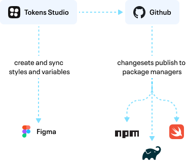
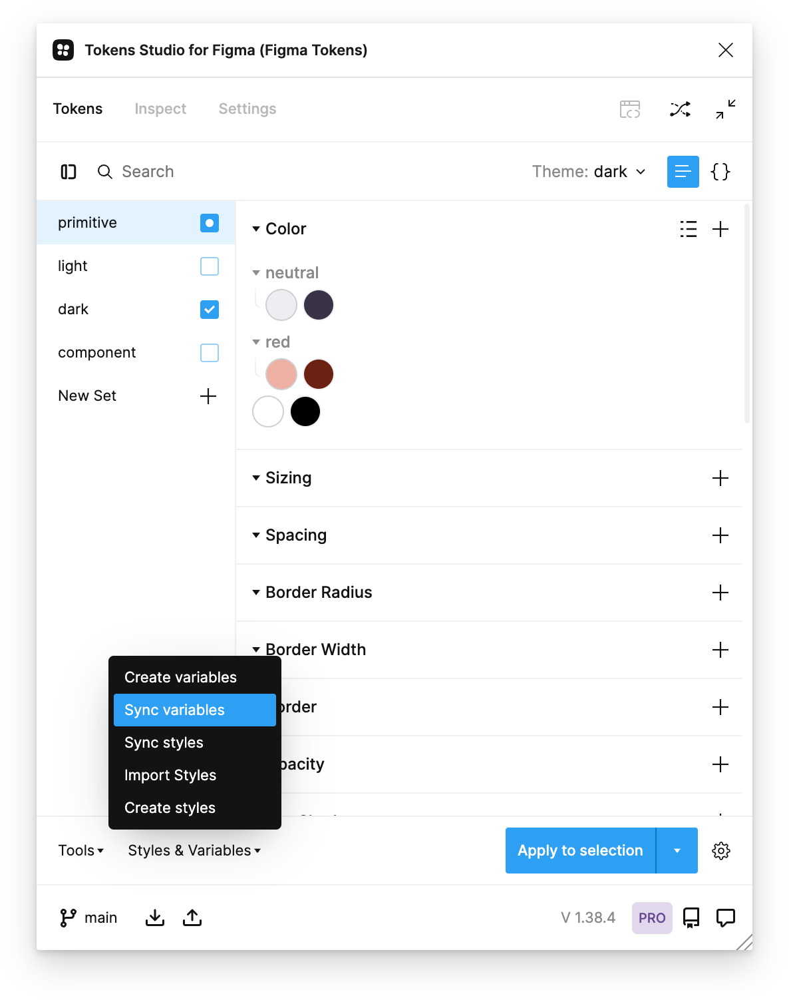

# token-dist

This is a minimal demonstration of how design tokens are created and managed in Figma using the [Tokens Studio](https://tokens.studio/) plugin, pushed to GitHub, versioned and published to GitHub Packages with [changesets](https://github.com/changesets/changesets), transformed into platform-specific formats, and consumed by applications.

## Notes

1. For the sake of simplicity this example only publishes CSS files. The build step can be updated to include as many platforms and transforming options as needed. 
2. The transformations use https://github.com/tokens-studio/sd-transforms, which uses [Style Dictionary](https://amzn.github.io/style-dictionary/#/quick_start) and adds a few Token Studio specific helper transformations. 
3. We are publishing to [GitHub Packages](https://github.com/features/packages) for this demo. We could also use npm if we wanted. GitHub Packages has the advantage of allowing private packages at no extra cost.

## Requirements

1. A [Tokens Studio Pro](https://tokens.studio/#pricing-2) account linked to a GitHub repository. This is the Figma plugin where we’ll create and manage the design tokens.
2. A GitHub [Personal Access Token](https://github.com/settings/tokens) with at least `read:packages` and `write:packages` permissions. See [About permissions for GitHub Packages](https://docs.github.com/en/packages/learn-github-packages/about-permissions-for-github-packages#about-scopes-and-permissions-for-package-registries) for more. You’ll had this Personal Access Token in two places.
   1. Add to your local `~/.npmrc` file with `//npm.pkg.github.com/:_authToken=TOKEN`. See ["Authenticating with a personal access token"](https://docs.github.com/en/packages/working-with-a-github-packages-registry/working-with-the-npm-registry#authenticating-with-a-personal-access-token).
   2. Add when first setting up the link in Tokens Studio to the token GitHub repository.

3. In the `package.json`  a `publishConfig` entry is required. See [GitHub Packages instructions](https://docs.github.com/en/packages/working-with-a-github-packages-registry/working-with-the-npm-registry).

```
  "publishConfig": {
    "registry": "https://npm.pkg.github.com"
  }
```

## Steps

This is a simplified illustration of the data flow from Tokens Studio to GitHub, and the consuming applications: Figma, Web, iOS, Android, etc.



The following describes the process of making changes to the tokens and then distributing them to Figma and a GitHub Package containing CSS. 

1. Create a branch in Token Studio, make changes, and open a pull request with those changes.
2. The pull request should also contain a “changeset” by running `npx changeset` and supplying a description of the changes and whether the change is major, minor, or patch. 
3. Once changes have been review and merged into `main` the tokens can be distributed.  

### Distribute to Figma

1. In Token Studio select the “Sync Variables” option. This will change, remove, and create new Figma variables as needed. 
   
2. Administrators of the Figma design file should review the results to make sure the tokens are correct as this is a destructive action.
3. The Figma library can now be published for use by your designers.

### Distribute to a GitHub package 

1. On your computer, pull the changes from the remote repository on the `main` branch where the token changes have been merged. 
2. Run `npx changeset version` . This takes in any unreleased “changesets”, determines the correct semver bump, updates the `CHANGELOG.md`, and versions the `package.json`. You can review the result of this process and make any changes before publishing.
4. Run `npx changeset publish` to publish your changes to your GitHub Package. This will create a [new version of the package](https://github.com/tomgenoni/token-dist/pkgs/npm/token-dist). 
5. Developers can now be alerted that a new version has been released and install it with  `npm install @tomgenoni/token-dist` after reviewing the `CHANGELOG.md`

## Future enhancements

1. Currently the entire repository is published in directory but ideally only the `dist` directory, the `CHANGELOG.md` and `package.json` would exist in the `node_modules` folder.
2. When a new version is published, a GitHub Action can be triggered that automatically opens PRs with the updated package to any consuming applications. 
3. Establish a detailed step-by-step guide to avoid ambiguity, how to recover from mistakes, etc. 
